# 《运行生命》全书图索引

版本 1.0。按原稿图号排序；图题逐字保留。成图、完整代码、认知任务、布局理由与复用组件均可在下方找到。

[浏览全部成图](FIGURE_INDEX.html) · [30 页矢量合订本](Running_Life_F01-F30.pdf) · [配色规范](PALETTE_SPECIFICATION.md) · [维护说明](MAINTENANCE.md)

## 图 F01｜基因组 染色体 DNA 和基因的关系

**认知任务：** 基因是 DNA 上的区域，染色体组织长 DNA，基因组统称一套 DNA 信息；它们不是四种互不相干的颗粒。

**布局理由：** 170×100 mm，两个panel：左侧细胞/核局部放大，右侧某条染色体的一段DNA及HBB区域；跨整套DNA的基因组括号独立于放大线；少量染色体为示意，不用条数声称23对。

**复用组件：** visual_grammar.boundary、organised_dna、dna_region、bracket、zoom_frame、zoom_link、label、line，以及book_style统一参数。

[png](outputs/png/F01_genome_chromosome_dna_gene.png) · [pdf](outputs/pdf/F01_genome_chromosome_dna_gene.pdf) · [svg](outputs/svg/F01_genome_chromosome_dna_gene.svg) · [Python](figures/F01_genome_chromosome_dna_gene.py)

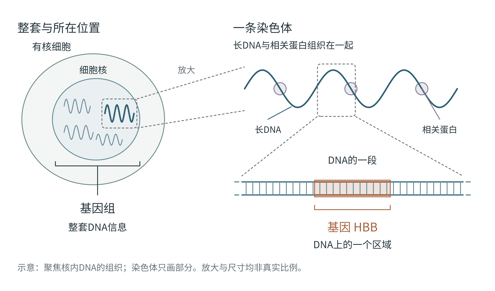

## 图 F02｜互补双链为复制提供参照

**认知任务：** 两条 DNA 链保存互补信息，特定配对让已有序列能够成为新链合成的参照。

**布局理由：** 上下平行双链展示反向端点和四组配对；短对应线不使用转化箭头。底部括注提炼已有序列提供参照。

**复用组件：** DNA骨架、单碱基文字、非因果配对线、集合括号、方向端点

[png](outputs/png/F02_complementary_strands.png) · [pdf](outputs/pdf/F02_complementary_strands.pdf) · [svg](outputs/svg/F02_complementary_strands.svg) · [Python](figures/F02_complementary_strands.py)

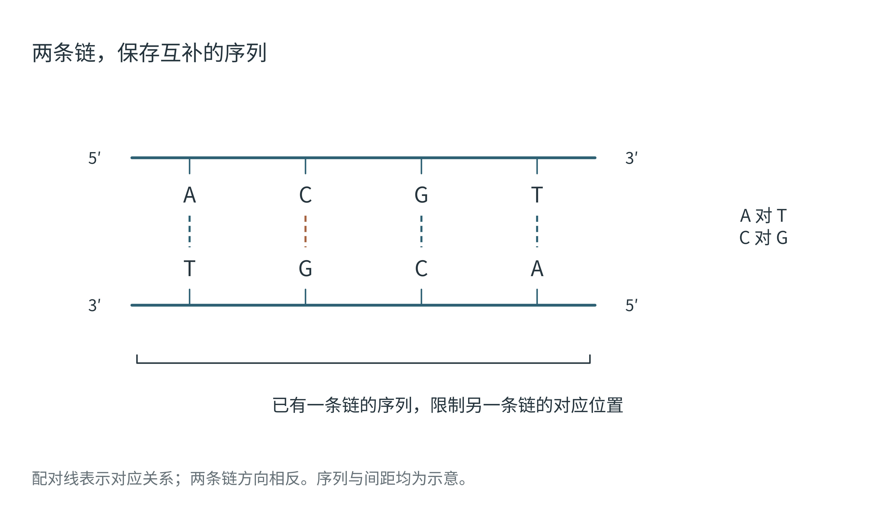

## 图 F03｜DNA 复制中的旧链与新链

**认知任务：** 原来的两条链各自带出一条新互补链，结果是两份各含一旧一新的 DNA。

**布局理由：** 三列从原双链经分离到两份结果；两条旧链保持连续路径，新链用铜色和虚线双重区分；原料入口独立。

**复用组件：** 连续链、模板箭头、合成箭头、原料容器、旧新身份标签

[png](outputs/png/F03_old_and_new_strands.png) · [pdf](outputs/pdf/F03_old_and_new_strands.pdf) · [svg](outputs/svg/F03_old_and_new_strands.svg) · [Python](figures/F03_old_and_new_strands.py)

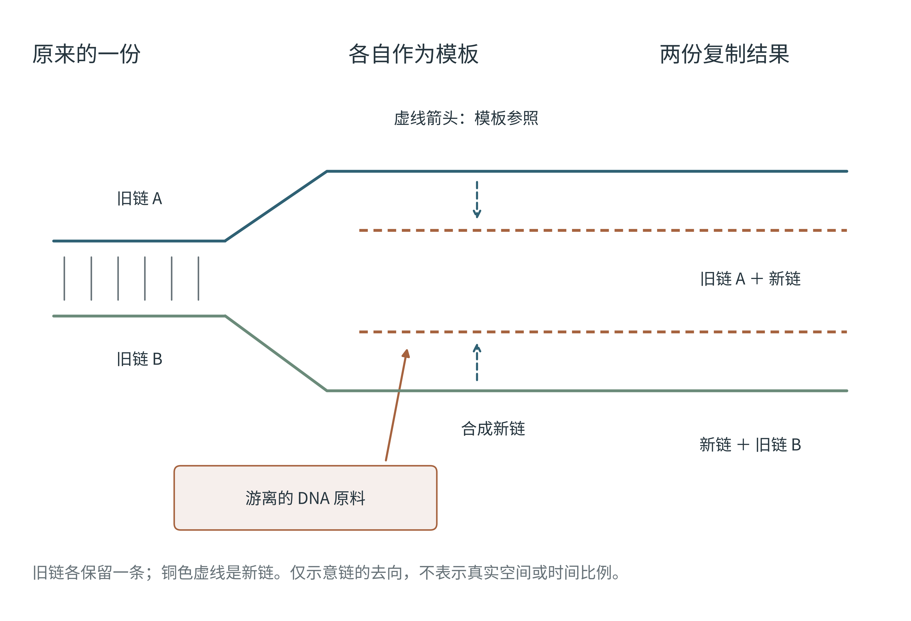

## 图 F04｜染色体重组与配子组合

**认知任务：** 连续片段的重组、配子取样与受精，把传下来的染色体版本组合成新的组合。

**布局理由：** 父母两条示例通道分别展示同源片段交换与抽取一种配子，再组合为双亲两份；用连续分块保持片段来源可追踪。片段以A/B字母与颜色双重编码，便于灰度追踪。

**复用组件：** 染色体分段、过程箭头、平行通道、受精组合、片段来源字母

[png](outputs/png/F04_recombination_and_gametes.png) · [pdf](outputs/pdf/F04_recombination_and_gametes.pdf) · [svg](outputs/svg/F04_recombination_and_gametes.svg) · [Python](figures/F04_recombination_and_gametes.py)

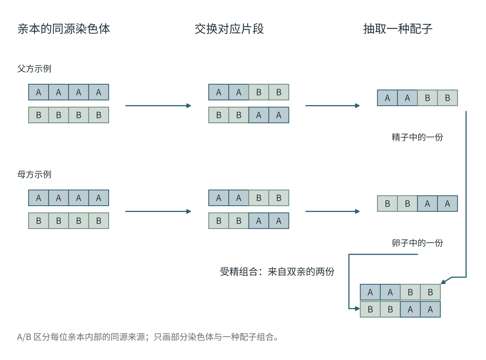

## 图 F05｜DNA 被转录后产生不同 RNA 版本

**认知任务：** DNA 提供模板而保持存在，初始 RNA 经不同剪接可得到不同成熟 RNA 版本。

**布局理由：** 左侧保留DNA并以模板关系连接初始RNA、原料另行合成；右侧上下两个分支显示不同片段组合。

**复用组件：** 双链、模板箭头、原料容器、片段条、分支过程箭头

[png](outputs/png/F05_transcription_and_splicing.png) · [pdf](outputs/pdf/F05_transcription_and_splicing.pdf) · [svg](outputs/svg/F05_transcription_and_splicing.svg) · [Python](figures/F05_transcription_and_splicing.py)

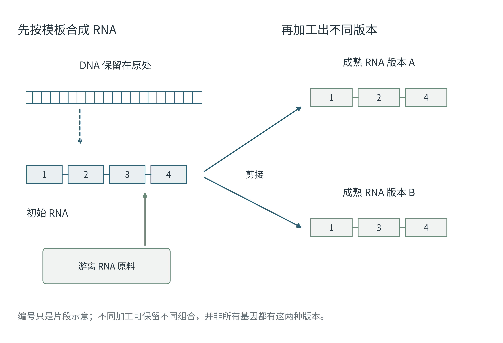

## 图 F06｜RNA 怎样指导氨基酸链的形成

**认知任务：** 核糖体和 tRNA 读取密码子，用另外取得的氨基酸连接新链，RNA 本身不变成蛋白质。

**布局理由：** 底部横向mRNA与读取方向固定；中部核糖体围住tRNA识别和肽链连接处，顶部原料输入与增长链分开。

**复用组件：** RNA骨架、密码子文字、核糖体轮廓、tRNA折线、氨基酸圆点、过程/模板箭头

[png](outputs/png/F06_translation.png) · [pdf](outputs/pdf/F06_translation.pdf) · [svg](outputs/svg/F06_translation.svg) · [Python](figures/F06_translation.py)

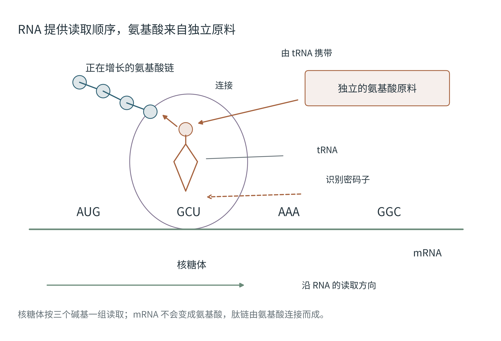

## 图 F07｜氨基酸顺序怎样影响蛋白质作用

**认知任务：** 顺序通过结构与表面性质影响分子接触，接触才让蛋白质参与细胞工作。

**布局理由：** 三个横向区分别展示链顺序、折叠及接触面、作用伙伴与细胞过程；条件箭头表达可能的影响，不设无依据定量。

**复用组件：** 氨基酸链、抽象折叠线、接触点、伙伴容器、条件箭头

[png](outputs/png/F07_sequence_structure_action.png) · [pdf](outputs/pdf/F07_sequence_structure_action.pdf) · [svg](outputs/svg/F07_sequence_structure_action.svg) · [Python](figures/F07_sequence_structure_action.py)

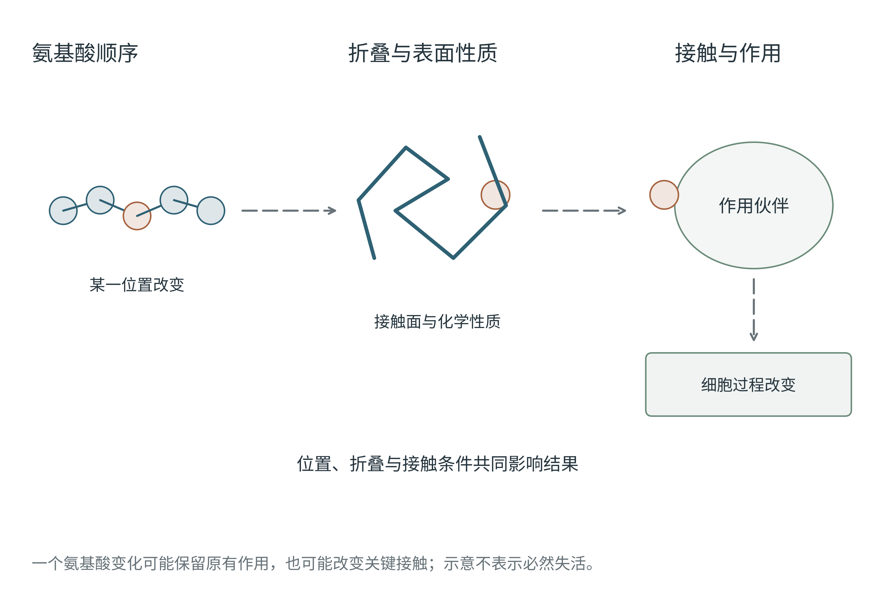

## 图 F08｜DNA 变化在不同层次的传播与缓冲

**认知任务：** 变化能否穿过各层，要看它改变了什么、是否被补偿，以及当时是否满足继续传播的条件。

**布局理由：** 170×140 mm；顶部五组覆盖七个层次，下方四条独立路径分别到达不同缓冲位置。各行等宽等高，通用条件与解释放在底注。

**复用组件：** 层级标题、并行节点、模板/条件箭头、缓冲强调、双行底注

[png](outputs/png/F08_propagation_and_buffering.png) · [pdf](outputs/pdf/F08_propagation_and_buffering.pdf) · [svg](outputs/svg/F08_propagation_and_buffering.svg) · [Python](figures/F08_propagation_and_buffering.py)

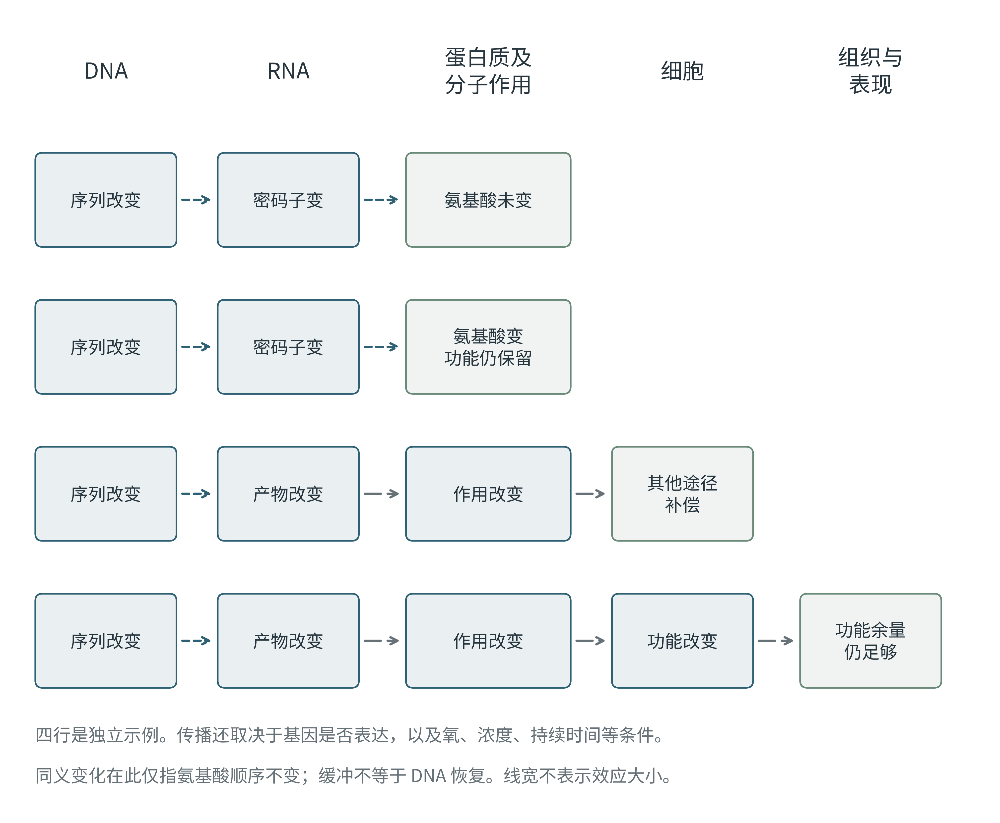

## 图 F09｜人的基因组不只有蛋白质编码序列

**认知任务：** 蛋白质编码只是基因组的一部分，许多其他序列影响信息使用、结构或尚待理解。

**布局理由：** 同一DNA条下方配置六种平行注释轨道；重叠区间表示注释可以交叠，明确所有长度和比例为示意。

**复用组件：** DNA双链、注释基线、功能区段、非比例说明

[png](outputs/png/F09_genome_annotation_tracks.png) · [pdf](outputs/pdf/F09_genome_annotation_tracks.pdf) · [svg](outputs/svg/F09_genome_annotation_tracks.svg) · [Python](figures/F09_genome_annotation_tracks.py)

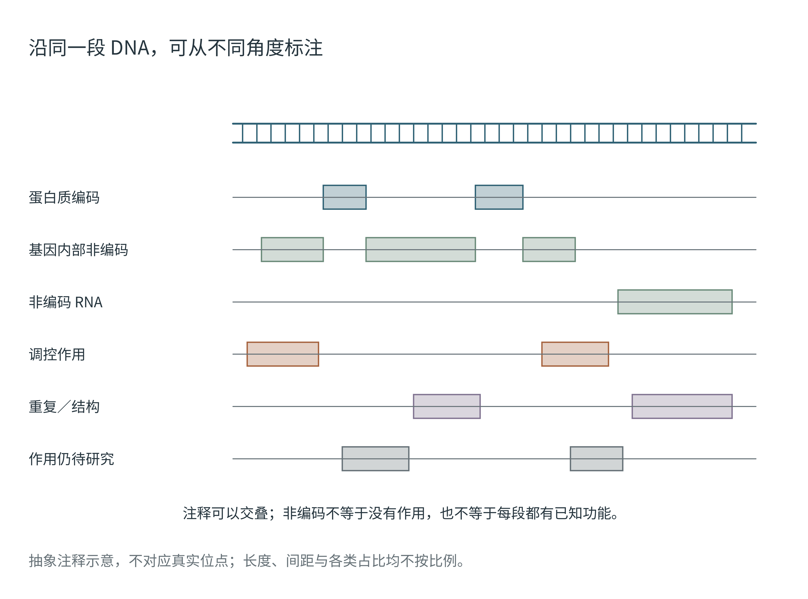

## 图 F10｜从 DNA 可接近到基因被使用

**认知任务：** 可接近性只是条件之一，调控蛋白状态、启动子组装和空间协作共同改变转录机会。

**布局理由：** 左侧局部包装提供接近条件，右侧连续折叠DNA使增强子靠近启动子与组装机器；DNA模板和RNA原料分别接入新RNA。

**复用组件：** DNA折线、区域强调、包装蛋白、转录因子与机器轮廓、接触线、模板/条件/过程箭头

[png](outputs/png/F10_access_to_transcription.png) · [pdf](outputs/pdf/F10_access_to_transcription.pdf) · [svg](outputs/svg/F10_access_to_transcription.svg) · [Python](figures/F10_access_to_transcription.py)

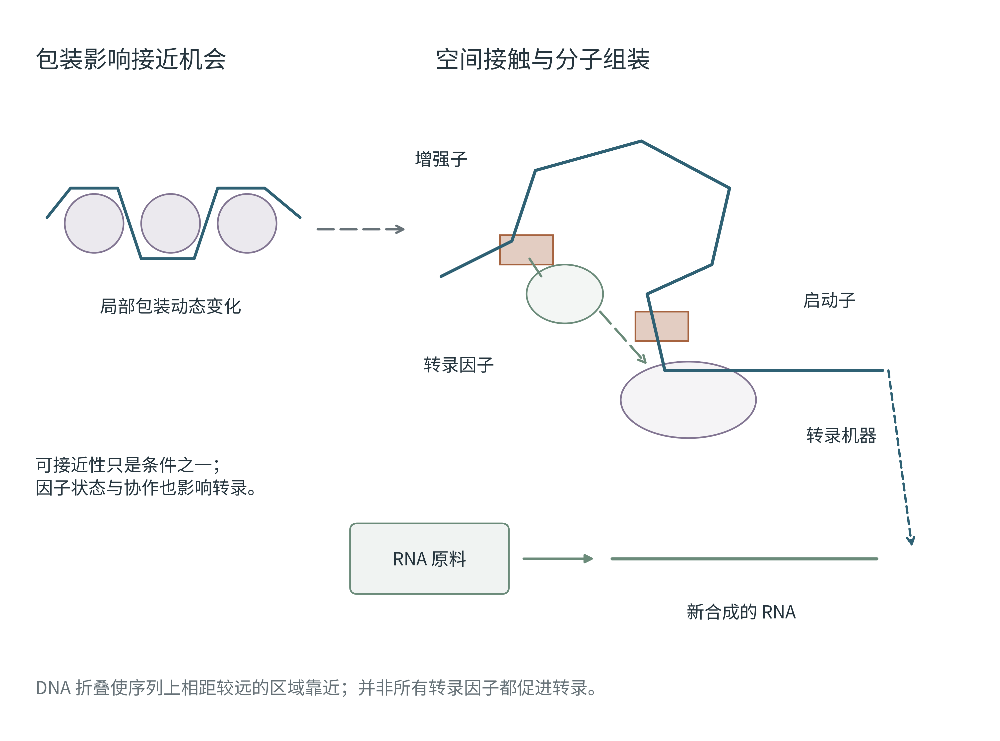

## 图 F11｜同一基因组运行不同细胞程序

**认知任务：** 相近基因组在不同调控环境中运行不同表达程序，产生不同分子组合与细胞行为。

**布局理由：** 170×116 mm。两行四列同位对照：相近 DNA、调控状态、RNA 与蛋白组合、细胞工作。神经元与皮肤细胞保留同形 DNA，A/B 标签及分子组合图区分使用程序；每行以三条条件影响线连接，行间细虚线仅用于分隔。

**复用组件：** 两组平行 DNA 片段、A/B 调控节点、RNA 线段与蛋白质图符、细胞功能节点、六条条件影响边、行分隔线、非计数范围说明。

[png](outputs/png/F11_cell_programs.png) · [pdf](outputs/pdf/F11_cell_programs.pdf) · [svg](outputs/svg/F11_cell_programs.svg) · [Python](figures/F11_cell_programs.py)

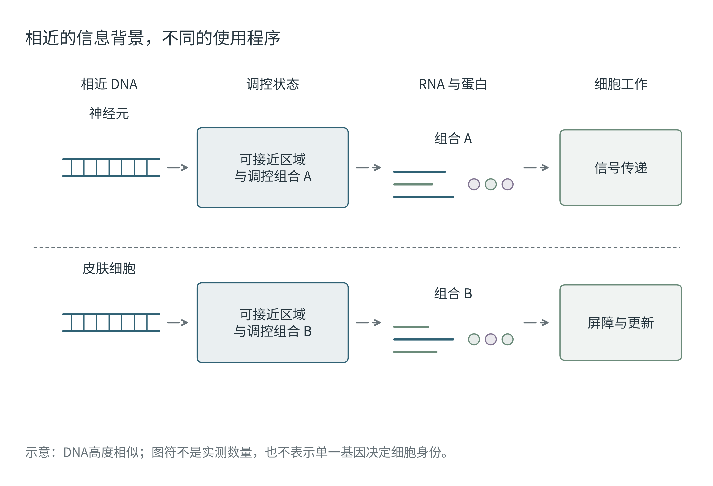

## 图 F12｜细胞怎样接收并回应外部信号

**认知任务：** 信号先经接收和已有分子状态变化，可快速改变行为，也可较慢地改变表达，结果取决于细胞原有状态。

**布局理由：** 170×116 mm。左侧外部输入跨入细胞边界，受体与已有蛋白状态居中；上方分支表示相对较快的既有蛋白作用，下方分支表示较慢的转录与新产物响应。顶部独立条件卡说明既有状态和信号持续时间；箭头不使用数值时间刻度。

**复用组件：** 细胞区域边界、外部信号节点、受体／感应节点、已有蛋白状态枢纽、上／下响应分支、条件输入节点、影响与条件边、相对时间范围说明。

[png](outputs/png/F12_signal_response.png) · [pdf](outputs/pdf/F12_signal_response.pdf) · [svg](outputs/svg/F12_signal_response.svg) · [Python](figures/F12_signal_response.py)

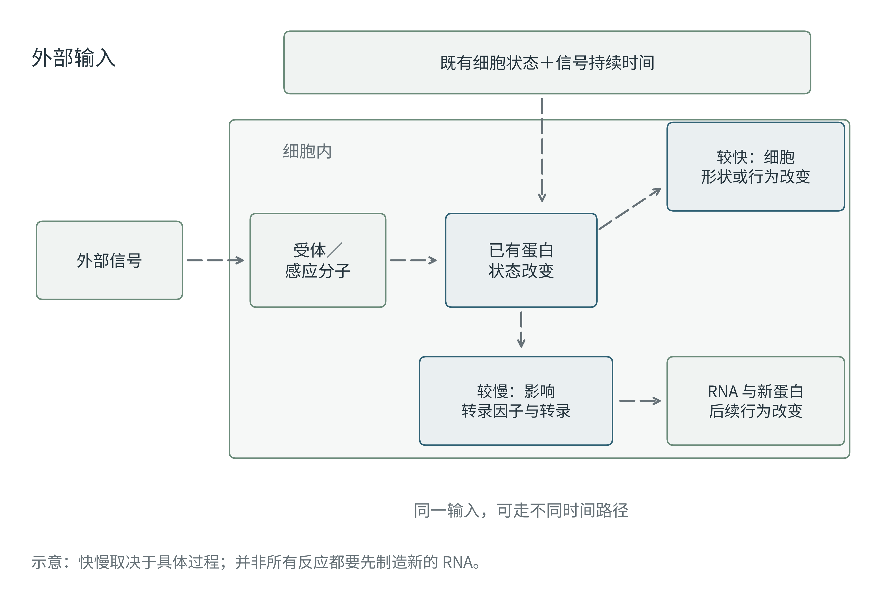

## 图 F13｜从细胞行为到组织结构的空间反馈

**认知任务：** 细胞行为改造空间，新的位置、邻居与基质又改变下一轮行为，组织由这种往返持续形成和维护。

**布局理由：** 170×116 mm。左侧为三枚上皮细胞、邻居接触和基质带的空间示意；右侧以“位置与邻居—局部信号与已有状态—行为组—空间与基质改变”四节点顺时针回路表达持续反馈。两部分分别承担空间定位和机制解释，不用静态组织画面替代回路。

**复用组件：** 三枚上皮轮廓与细胞核、接触短线、基质带、空间输入文字、四个反馈节点、三条影响边与一条行为过程边、行为非必经序列范围说明。

[png](outputs/png/F13_spatial_feedback.png) · [pdf](outputs/pdf/F13_spatial_feedback.pdf) · [svg](outputs/svg/F13_spatial_feedback.svg) · [Python](figures/F13_spatial_feedback.py)

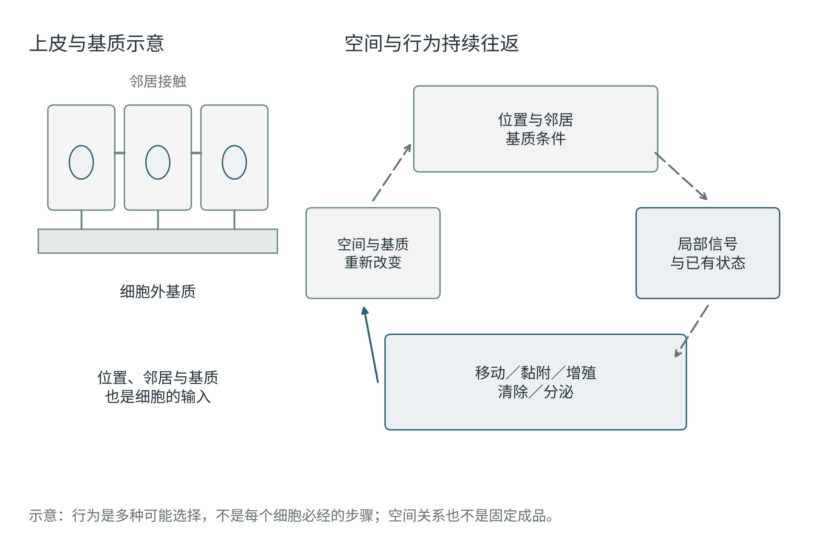

## 图 F14｜相同 DNA 的不同表观状态

**认知任务：** 同一DNA序列可以处于不同化学和染色质状态，从而拥有不同的分子接触机会。

**布局理由：** 170×116 mm。上下两行在相同位置展示 A T C G A C 序列，状态 B 的同一 C 上附加甲基标记；右侧局部染色质曲线及周边蛋白表现不同环境。连接采用无箭头的虚线观察／放大关系，序列相同另以底部文字确认，不将甲基化等同于关闭。

**复用组件：** 两组相同 DNA 梯形骨架与六字母序列、状态 A/B 标签、一枚甲基圆点与键线、局部染色质曲线、周边蛋白图符、两条无箭头放大线、序列身份与作用范围说明。

[png](outputs/png/F14_epigenetic_states.png) · [pdf](outputs/pdf/F14_epigenetic_states.pdf) · [svg](outputs/svg/F14_epigenetic_states.svg) · [Python](figures/F14_epigenetic_states.py)

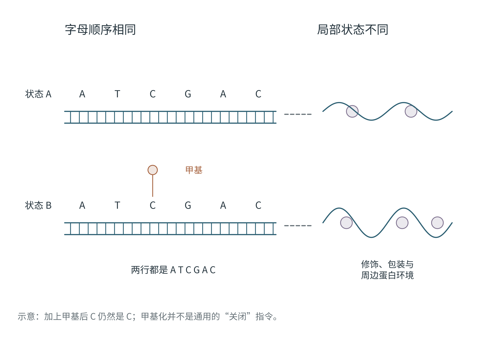

## 图 F15｜基因调控与表观状态相互影响

**认知任务：** 表观状态与基因调控彼此塑造，稳定身份来自动态网络，不是一枚标记的独立命令。

**布局理由：** 170×116 mm。上部三节点从染色质状态经分子接触与调控组合指向启动子／增强子协作及转录；下部单列“相关蛋白识别／招募、局部重塑”节点形成独立返回路径。顶部外部信号与历史分别影响状态和调控活动，两个方向用各自机制说明，不用一根双向箭头代替。

**复用组件：** 三个前向调控节点、局部重塑节点、顶部情境节点、前向影响／条件边、两条返回影响边、上下方向说明、关联不足以证明因果的范围说明。

[png](outputs/png/F15_regulatory_feedback.png) · [pdf](outputs/pdf/F15_regulatory_feedback.pdf) · [svg](outputs/svg/F15_regulatory_feedback.svg) · [Python](figures/F15_regulatory_feedback.py)

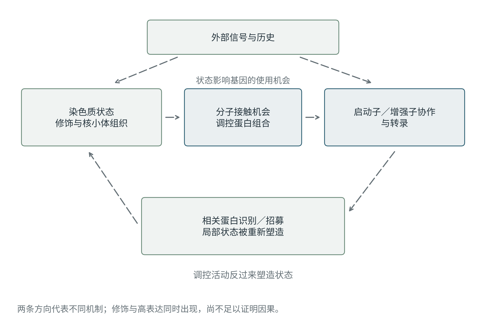

## 图 F16｜同一 DNA 可以产生不同 RNA 图景

**认知任务：** 相近DNA之下，RNA可在存在、数量或剪接版本上不同，且某些基因保持不变。

**布局理由：** 170×126 mm。顶部一份共同 DNA 背景，下方 A/B 两条件形成四行矩阵；依次对照检出情况、RNA 定性数量、剪接版本 1—2—4／1—3—4 和不变参照。各行共用列位置与行分隔线，分子图符仅传达定性差别。

**复用组件：** 共同 DNA 片段、两个条件列边界、四个行标签、RNA 线段图符、六个外显子段及短连接、不变参照、RNA 存量不等于即时速率范围说明。

[png](outputs/png/F16_rna_landscapes.png) · [pdf](outputs/pdf/F16_rna_landscapes.pdf) · [svg](outputs/svg/F16_rna_landscapes.svg) · [Python](figures/F16_rna_landscapes.py)

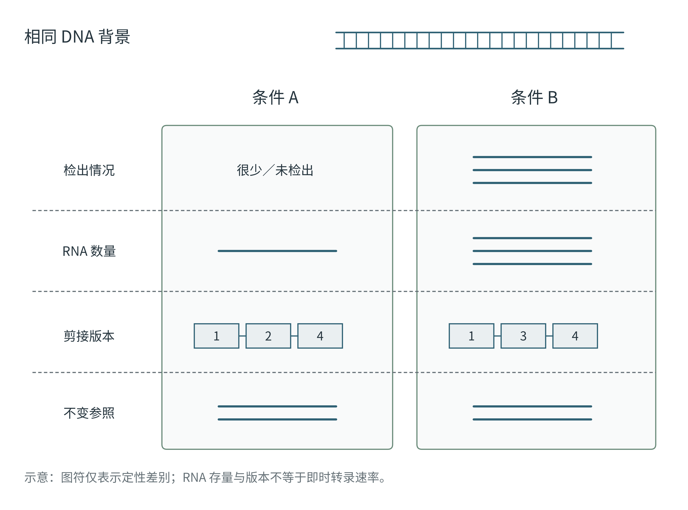

## 图 F17｜蛋白质数量与功能状态

**认知任务：** 蛋白质的数量相同，修饰、位置与结合伙伴不同仍可能改变功能。

**布局理由：** 170×126 mm。三个等宽独立面板，每个上 A 下 B：磷酸化、细胞内位置、结合伙伴。各对主蛋白数保持一致；中间面板以细胞和细胞核嵌套边界定位。顶部说明总量相同，底部仅写“功能可能改变”，不添加未经支持的特定活性结果。

**复用组件：** 三个对照面板、每组 A/B 标签、等量主蛋白图符、含 P 的磷酸基标记、两组细胞／细胞核边界、游离／结合伙伴、可能结果和非计数范围说明。

[png](outputs/png/F17_protein_states.png) · [pdf](outputs/pdf/F17_protein_states.pdf) · [svg](outputs/svg/F17_protein_states.svg) · [Python](figures/F17_protein_states.py)

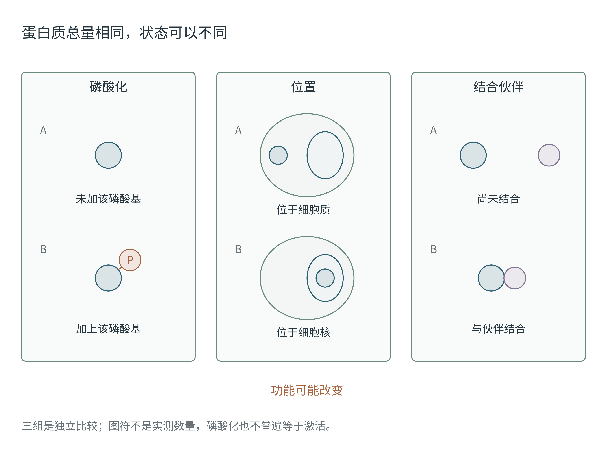

## 图 F18｜相同代谢物浓度与不同代谢流

**认知任务：** 一个时点的存量由多种流入流出过程共同决定，浓度相同不代表周转过程相同。

**布局理由：** 170×116 mm。左右两组使用同样体积的池和相同概念数量图符，制造在上、消耗在下、输入在左、输出在右。顶部标签分别表示较慢／较快周转，四向过程箭头保持等宽；底部明确相同体积、相同浓度和单时点比较。

**复用组件：** 两个相同代谢池、各六枚定性小分子图符、八条等宽物质过程箭头、制造／输入／输出／消耗标签、较慢／较快周转标题、相同状态和无实测数值说明。

[png](outputs/png/F18_metabolic_flux.png) · [pdf](outputs/pdf/F18_metabolic_flux.pdf) · [svg](outputs/svg/F18_metabolic_flux.svg) · [Python](figures/F18_metabolic_flux.py)

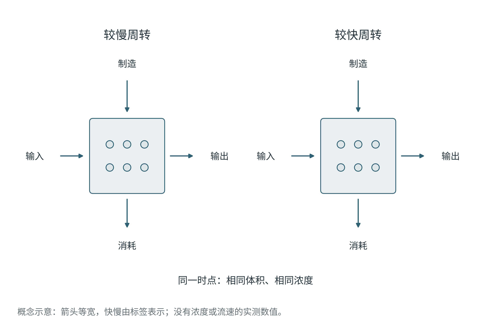

## 图 F19｜五扇窗口观察同一个细胞

**认知任务：** 五个窗口分别观察同一系统的序列、调控状态、RNA、蛋白与代谢存量，各有范围与盲点。

**布局理由：** 170×126 mm。中央唯一细胞系统容器内放置 DNA 与调控状态、RNA、蛋白质和代谢物；上方三窗、下方两窗分别与对应测量端口相连。紫色点线无箭头，窗口之间不连因果链；系统标签位于中央留白，避免观察线穿字。

**复用组件：** 单一细胞椭圆边界、DNA 骨架与状态标记、RNA 线段、蛋白与代谢物图符、五个观察卡、五条无箭头点线、五枚测量端口、检测范围和同一细胞系统含义说明。

[png](outputs/png/F19_five_windows.png) · [pdf](outputs/pdf/F19_five_windows.pdf) · [svg](outputs/svg/F19_five_windows.svg) · [Python](figures/F19_five_windows.py)

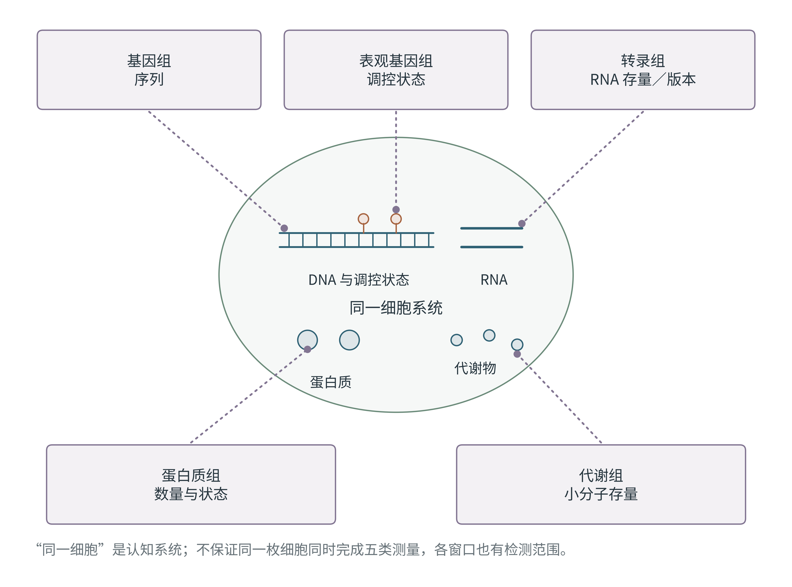

## 图 F20｜从结肠组织到结直肠癌的跨层观察

**认知任务：** 配对样本中各层测量能检验同一疾病故事，任一层变化仍不保证下一层同向改变。

**布局理由：** 左右两列对照同一个人的非肿瘤结肠黏膜与结直肠癌组织；五行分别显示DNA、RNA、蛋白质、代谢物和组织行为。取样关系用观察点线，不用演变箭头。

**复用组件：** 同人取样标题、两份样本节点、两条观察取样线、五个层级标签、十个并列观察卡、配对而非纵向及跨层解释待检验范围说明。

[png](outputs/png/F20_colorectal_observations.png) · [pdf](outputs/pdf/F20_colorectal_observations.pdf) · [svg](outputs/svg/F20_colorectal_observations.svg) · [Python](figures/F20_colorectal_observations.py)

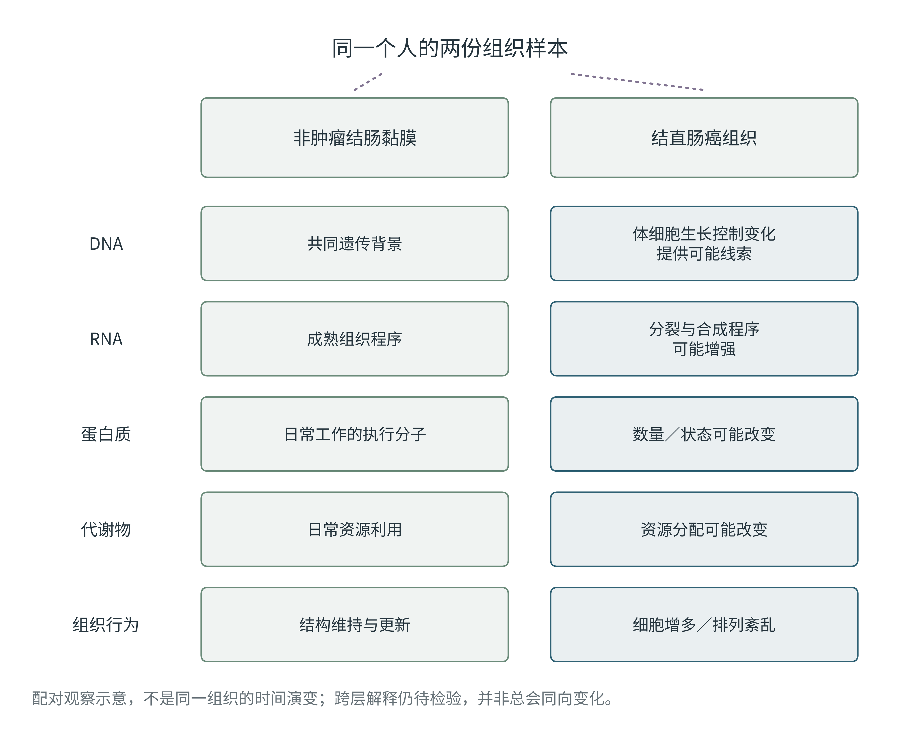

## 图 F21｜从组织平均值到细胞与空间

**认知任务：** 群体、单细胞与空间观察保留不同信息：总体变化、细胞来源和原位关系不能互相替代。

**布局理由：** 同一组织位于上方，三条无箭头观察连线分到横向并列的群体、单细胞与空间面板；以混合括号、散列身份、原位小图表现各自保留的信息，避免升级阶梯。

**复用组件：** 带身份汉字的细胞圆形、组织边界、紫色观察连线、集合括号、位置框、均值歧义注释

[png](outputs/png/F21_tissue_cell_space.png) · [pdf](outputs/pdf/F21_tissue_cell_space.pdf) · [svg](outputs/svg/F21_tissue_cell_space.svg) · [Python](figures/F21_tissue_cell_space.py)

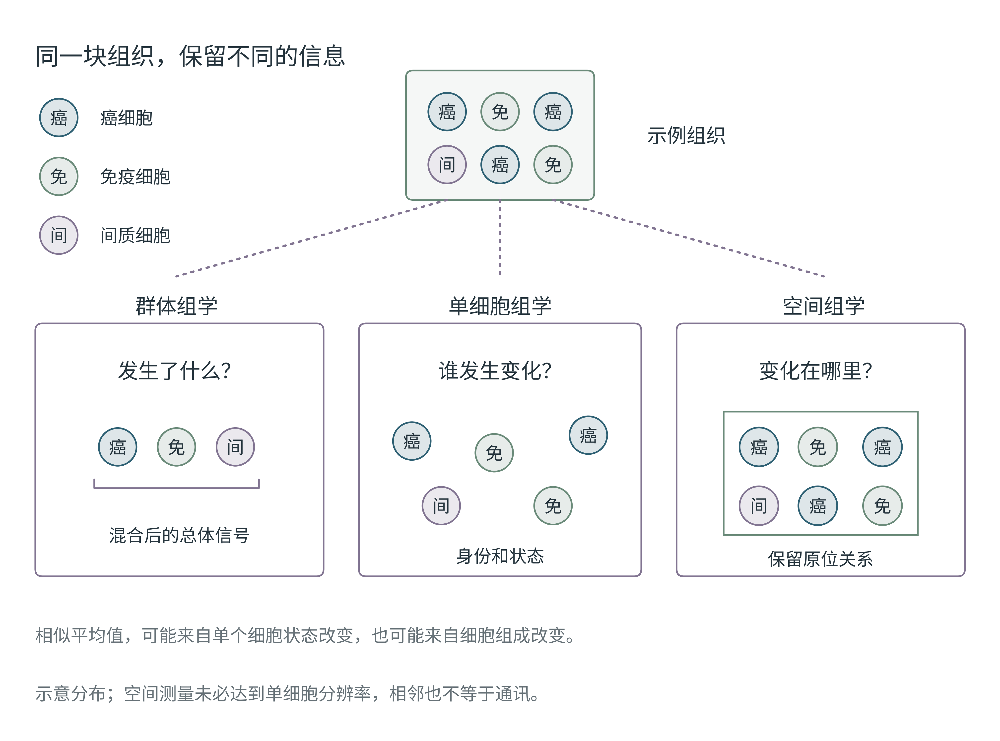

## 图 F22｜同样风险翻倍，不同绝对风险

**认知任务：** 相对倍数相同不等于绝对变化相同，必须同时看基线、人群与观察期。

**布局理由：** 两行各两组严格100个等大的点，1/100到2/100与10/100到20/100共享图形分母和未来十年观察期；右侧分别写相对倍数与绝对百分点。

**复用组件：** 固定100点网格、实心/空心双编码、相对倍数文本、绝对百分点文本、同分母括号

[png](outputs/png/F22_relative_absolute_risk.png) · [pdf](outputs/pdf/F22_relative_absolute_risk.pdf) · [svg](outputs/svg/F22_relative_absolute_risk.svg) · [Python](figures/F22_relative_absolute_risk.py)

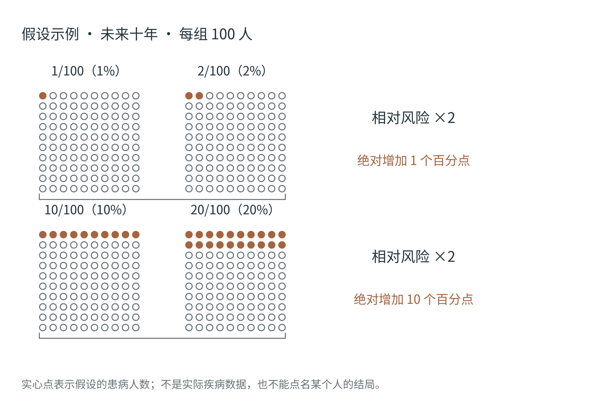

## 图 F23｜风险描述未来机会

**认知任务：** 风险是用相似人群经验估计特定时期的未来机会，不是对某个个体结局的预先点名。

**布局理由：** 上部人群证据与估计窗口通过观察线关联；中部个体现状分出两条非比例的未来可能；底部条件带以影响关系进入未来判断。

**复用组件：** 参照人群卡、概率估计窗、条件分支、未来状态卡、自然影响线、非比例边界注释

[png](outputs/png/F23_risk_future_possibilities.png) · [pdf](outputs/pdf/F23_risk_future_possibilities.pdf) · [svg](outputs/svg/F23_risk_future_possibilities.svg) · [Python](figures/F23_risk_future_possibilities.py)

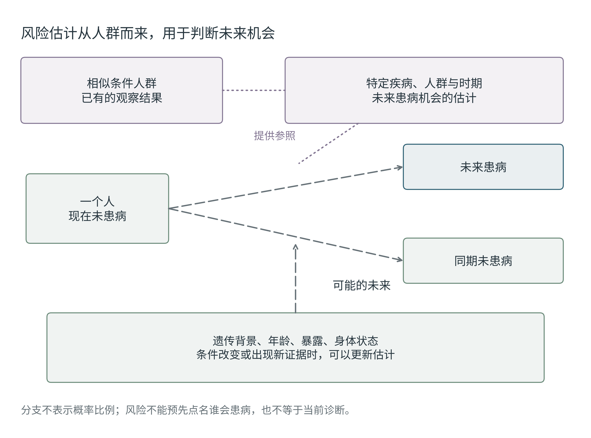

## 图 F24｜相似疾病表现可以来自不同路径

**认知任务：** 相似组织表现可以由不同路径形成和维持，分子检测要辨认关键机制，不能把每个变化都当原因。

**布局理由：** 两条不同机制路径汇合肺腺癌组织表现，甲保留特定EGFR路径，乙保留其他/未知；下部独立的分子检测观察窗追问机制。

**复用组件：** 汇合条件线、未知路径节点、疾病分类节点、紫色观察端口、因果边界说明

[png](outputs/png/F24_converging_disease_paths.png) · [pdf](outputs/pdf/F24_converging_disease_paths.pdf) · [svg](outputs/svg/F24_converging_disease_paths.svg) · [Python](figures/F24_converging_disease_paths.py)

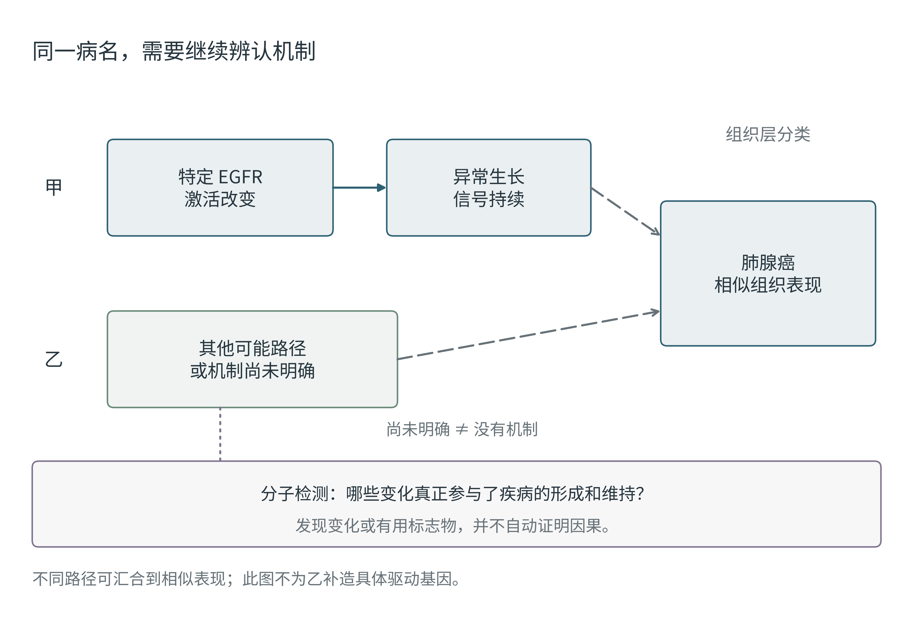

## 图 F25｜生命链条上的不同治疗入口

**认知任务：** 治疗可在能改变疾病过程的不同层进入，最初病因不是唯一入口，且每条入口都有递送、持续性与风险条件。

**布局理由：** 140毫米高的四个独立病例行共享DNA、RNA、蛋白作用、细胞和组织个体的横向导航；只展开本行局部机制，橙色入口直接指向RNA剪接、RNA减少、蛋白功能或系统输入。

**复用组件：** 五组层级导航、原DNA保留轨、病例分隔、橙色干预端口、模板虚线、条件影响线、PKU输入节点

[png](outputs/png/F25_treatment_entry_points.png) · [pdf](outputs/pdf/F25_treatment_entry_points.pdf) · [svg](outputs/svg/F25_treatment_entry_points.svg) · [Python](figures/F25_treatment_entry_points.py)

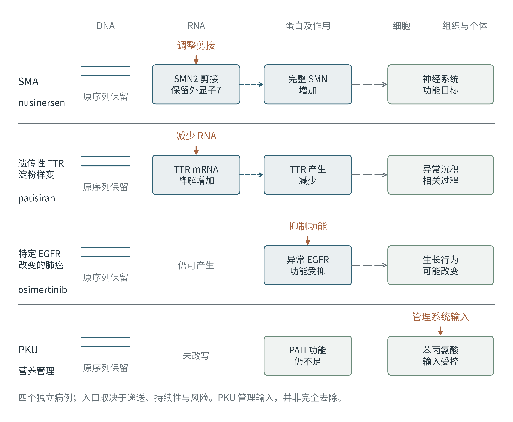

## 图 F26｜引导 RNA 定位与执行工具的不同任务

**认知任务：** 可编程定位把工具带到指定区域，随后执行的切割、碱基改写或调控是可区分的任务。

**布局理由：** 左侧空间定位模块连接右侧两种执行面板；上方切开DNA后独立进入细胞修复与不同可能结果，下方连续DNA表现碱基改写。

**复用组件：** DNA目标区域、引导RNA识别短线、定位载体、无箭头工具选择线、断链、修复分支、连续链局部改写

[png](outputs/png/F26_guide_and_execution_tools.png) · [pdf](outputs/pdf/F26_guide_and_execution_tools.pdf) · [svg](outputs/svg/F26_guide_and_execution_tools.svg) · [Python](figures/F26_guide_and_execution_tools.py)

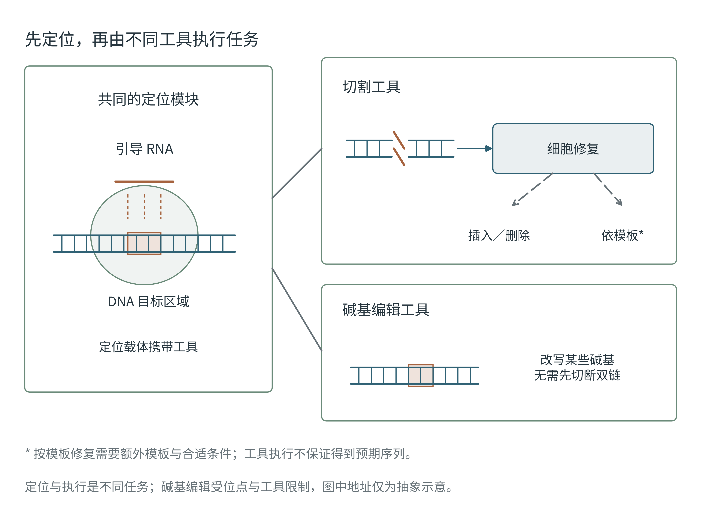

## 图 F27｜KJ 的分子修复与临床观察

**认知任务：** 个体化编辑把分子设计推进到人体，但单人早期观察与后续更新仍需同长期安全和持续获益分开判断。

**布局理由：** 140毫米高的三个清晰层：设计验证递送；以拟实现文字和条件线表示作用目标；分别标注2025早期报告和2026医院更新的单人观察卡。

**复用组件：** 设计节点、过程线、目标DNA、条件机制链、紫色临床观察卡、年份标记、长期未定边界

[png](outputs/png/F27_kj_mechanism_and_observation.png) · [pdf](outputs/pdf/F27_kj_mechanism_and_observation.pdf) · [svg](outputs/svg/F27_kj_mechanism_and_observation.svg) · [Python](figures/F27_kj_mechanism_and_observation.py)

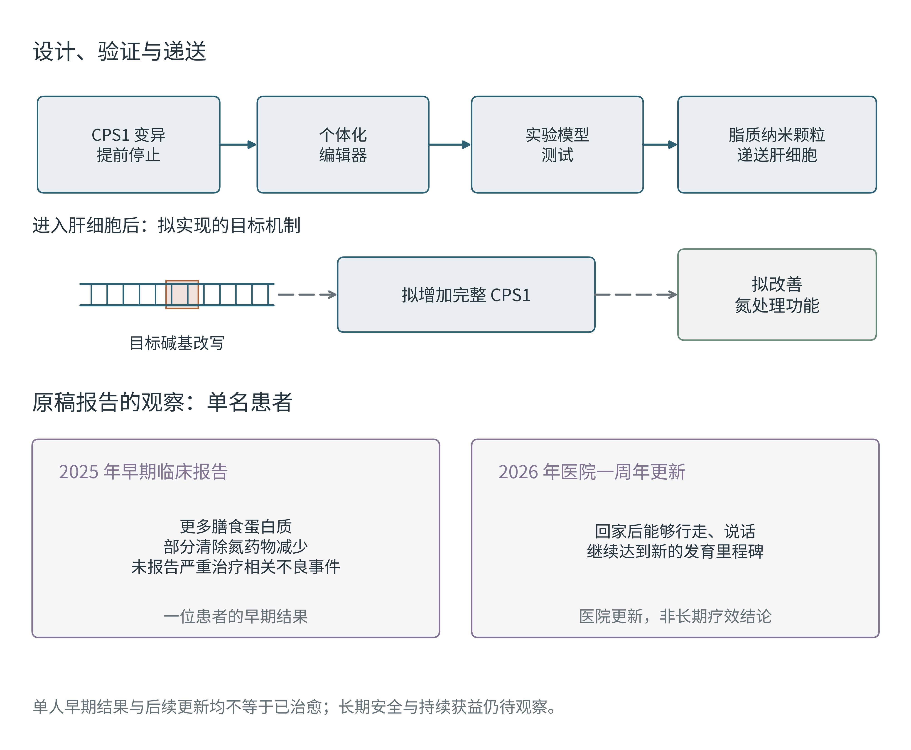

## 图 F28｜修改原有序列与补充功能性副本

**认知任务：** 修改原有序列与添加功能性版本是两种不同动作，二者都须在目标细胞中形成足够且持续的功能。

**布局理由：** 相同细胞起点的左右对照；左在原位置改写，右保留原异常版本且另置额外功能信息，不画染色体整合；底部共享表达和功能条件。

**复用组件：** 细胞边界、持续原DNA、目标位点、额外信息双轨、干预箭头、条件表达带

[png](outputs/png/F28_edit_or_add_functional_copy.png) · [pdf](outputs/pdf/F28_edit_or_add_functional_copy.pdf) · [svg](outputs/svg/F28_edit_or_add_functional_copy.svg) · [Python](figures/F28_edit_or_add_functional_copy.py)

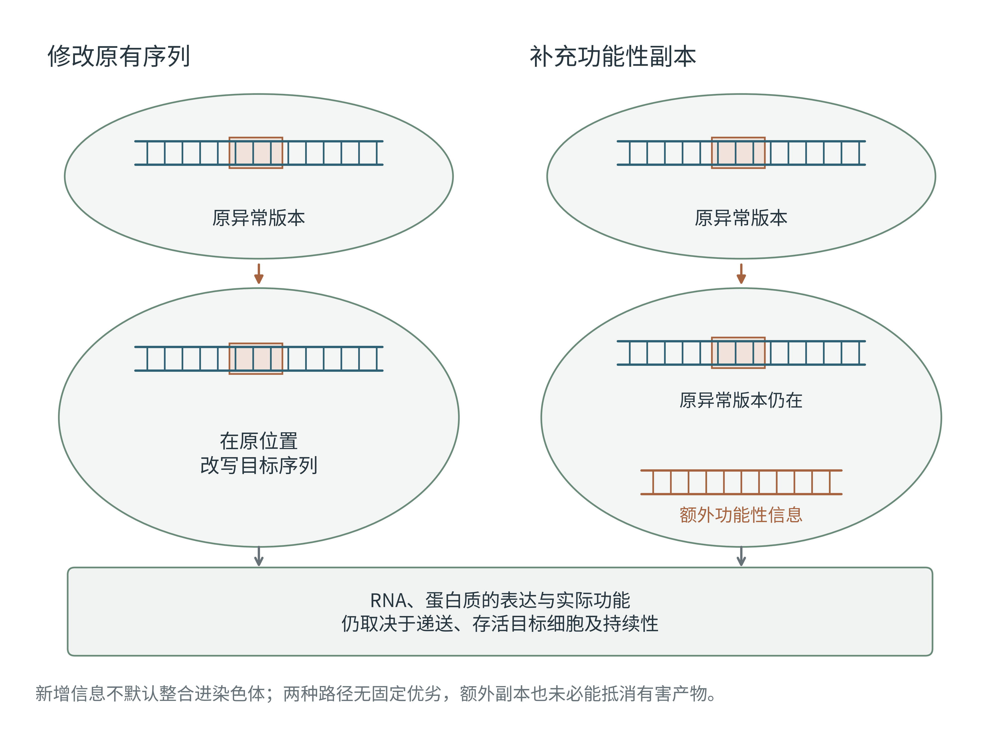

## 图 F29｜CAR T 进入身体后仍继续运行

**认知任务：** 细胞治疗在体内继续识别、反应和变化，其作用、风险与可能逃逸都来自持续的细胞—环境互动。

**布局理由：** 上部为CAR-T迁移识别响应扩增与再搜索环；下方左右分别解释CD19的正常B细胞在靶影响及治疗后的可能群体变化。

**复用组件：** 运行环、条件响应、持续或失功分支、同CD19标记、不同细胞身份、可能群体选择、风险边界注释

[png](outputs/png/F29_cart_continues_in_body.png) · [pdf](outputs/pdf/F29_cart_continues_in_body.pdf) · [svg](outputs/svg/F29_cart_continues_in_body.svg) · [Python](figures/F29_cart_continues_in_body.py)

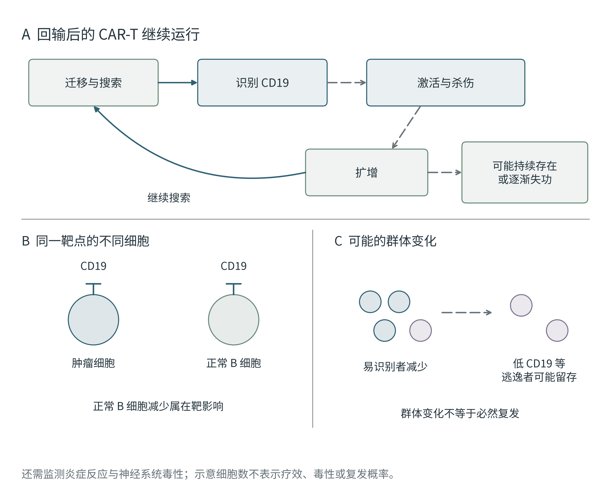

## 图 F30｜从工具工作到患者持续获益

**认知任务：** 治疗需分别跨过正确递送、分子改变、细胞工作、关键细胞覆盖、组织功能与持续患者获益六道门，安全和时间贯穿全程。

**布局理由：** 六个等权证据卡按两行三列编号，使用无箭头阅读连线；第四门专问细胞数量位置，第五门单独判断组织功能；时间和安全两条全宽带明确每道门都要追问。

**复用组件：** 六门证据问题卡、六个紫色观察端口、无箭头阅读序线、持续性带、安全带、分母提醒

[png](outputs/png/F30_six_gates_patient_benefit.png) · [pdf](outputs/pdf/F30_six_gates_patient_benefit.pdf) · [svg](outputs/svg/F30_six_gates_patient_benefit.svg) · [Python](figures/F30_six_gates_patient_benefit.py)

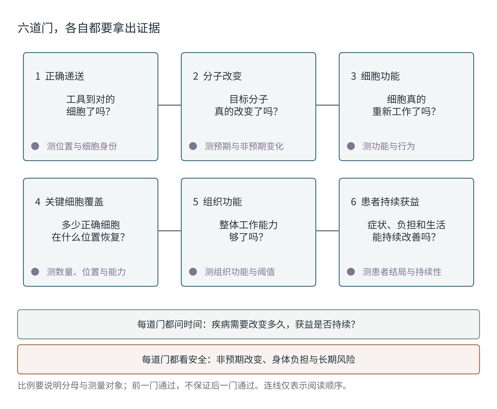
