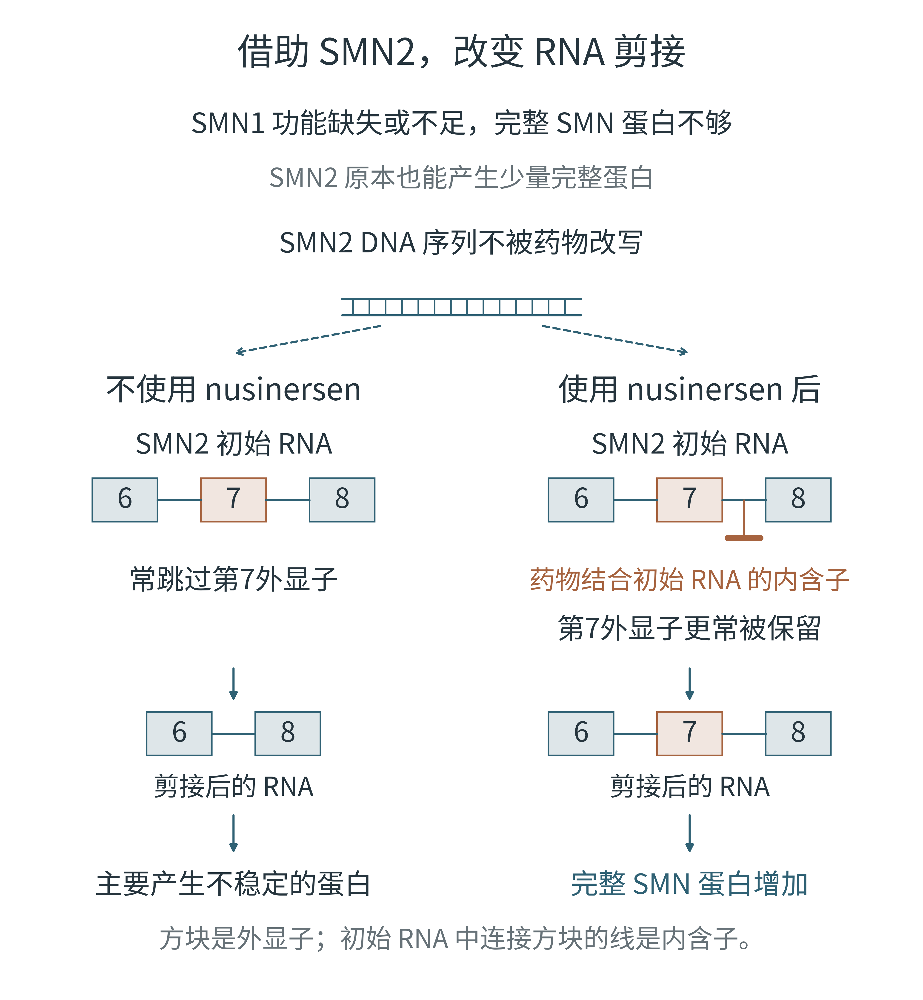

# 第十章 SMA 剪接补充图

## F25a 改变 SMN2 RNA 的剪接结果

当前采用作者于2026年10月3日提供并选定的图片，替换此前生成的配图。



- [当前配图 PNG](outputs/png/F25a_smn2_splicing.png)
- [作者提供的原图](assets/F25a_user_supplied.png)
- [原图复制与校验脚本](F25a_smn2_splicing.py)
- [原图一致性记录](outputs/manifests/F25a_validation.json)

## 插入位置

第十章“不修 DNA，只改变一次剪接”小节，解释 nusinersen 结合初始 RNA、使第七外显子更容易保留的段落之后，“结果是：更多完整的 SMN2 RNA。”之前。当前采用补充图号 F25a，全书正式排版时可统一编号。

## 图注

图 F25a｜改变 SMN2 RNA 的剪接结果。图中仅示意第6—8外显子。原有剪接倾向下，较多 RNA 跳过第7外显子；药物结合附近内含子后，保留第7外显子的 RNA 比例提高，从而产生更多完整 SMN 蛋白。图示为产物比例的方向性变化，并非所有 RNA 都采用同一种剪接。

## 文件说明

当前 PNG 为958 × 486像素，与作者上传的图片逐字节一致，未重新绘制、改字、裁切或放大。它是栅格原图；当前没有与之对应的原始可编辑矢量源码。图中铜色分支表示用药条件下的剪接路径，不是药物结合位点的精确定位。方块编号为外显子，方块宽度和箭头不表示实测比例。

运行下面的脚本可从保留的原图复制当前 PNG，并更新一致性记录：

```sh
python chapter10_additions/F25a_smn2_splicing.py
```

## 此前生成版本

此前版本的源码、PNG、PDF、SVG及布局检查保留在Git历史中。它们属于此前那张图，不对应当前替换图：

- [此前版本全部文件](https://github.com/Joe0908/-_figures/tree/b78e50e1cae8b5af5b15ba45f2c592fa8a30b84b/chapter10_additions)

## 机制依据

- [SPINRAZA 官方处方说明，§11与§12.1](https://dailymed.nlm.nih.gov/dailymed/fda/fdaDrugXsl.cfm?setid=dd70cd5f-b0fc-4ba4-a5ea-89a34778bd94&type=display)：nusinersen 结合 SMN2 第7外显子下游内含子的特定序列，增加第7外显子保留及完整 SMN 蛋白产生。
- [美国国家医学图书馆 MedlinePlus Genetics，SMN2](https://medlineplus.gov/genetics/gene/smn2/)：SMN2 可补充部分缺失的 SMN 蛋白。
