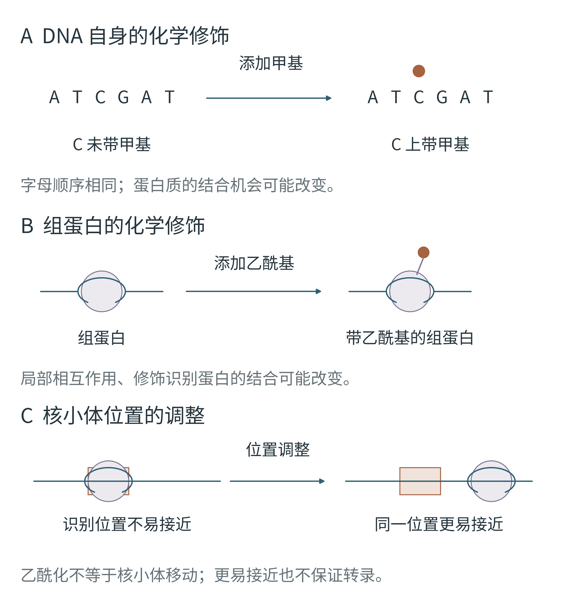
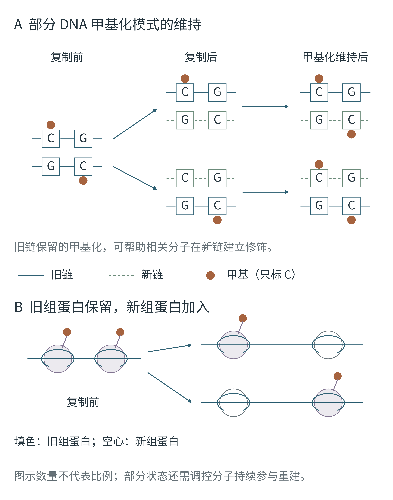

# 第五章新版配图 F14–F15

对应新版第五章《DNA 不变，细胞怎样记住自己是谁？》。使用上传的《运行生命_第五章_表观调控机制重构版(4).docx》作为内容依据；沿用全书「海青与铜」配色和 Noto Sans SC 图中文字。

| 图号 | 图题与阅读任务 | 插入位置 | 可修改源码 | 导出 |
|---|---|---|---|---|
| F14 | 相同的 DNA 序列，不同的化学与染色质状态：区分甲基化、组蛋白乙酰化与核小体位置调整 | 新稿原有 F14 图注之前，即“DNA 周围的包装，也可以发生变化”一节末 | [Python](F14_epigenetic_states.py) | [PNG](outputs/png/F14_epigenetic_states.png) · [PDF](outputs/pdf/F14_epigenetic_states.pdf) · [SVG](outputs/svg/F14_epigenetic_states.svg) |
| F15 | DNA 复制以后，部分表观状态如何得到维持或重建：区分 DNA 字母复制与部分状态的延续 | 新稿原有 F15 图注之前，即“细胞分裂以后，原来的状态去了哪里？”一节末 | [Python](F15_state_maintenance.py) | [PNG](outputs/png/F15_state_maintenance.png) · [PDF](outputs/pdf/F15_state_maintenance.pdf) · [SVG](outputs/svg/F15_state_maintenance.svg) |

## 成图





## 修改与重建

在仓库根目录安装原有 requirements.txt 中的依赖后运行：

```sh
python chapter5_revision/build_chapter5.py
```

单独修改一张图可直接运行对应脚本。`LAYOUT` 控制画布尺寸和关键坐标；`build_figure()` 内的文字、形状和坐标均可编辑。`chapter_drawing.py` 复用根目录字体、配色与几何检查，不修改其他章节的共用样式。

两图主版宽度为 170 mm，Word 中宽度为 108 mm。主版最小字号 13.5 pt，排入书页后约为 8.58 pt；PNG 600 dpi，PDF/SVG 保持矢量结构，SVG 包含可编辑文字、对象 ID 和内嵌字体。

F14 的铜色圆点在 A 面板代表甲基、在 B 面板代表乙酰基；意义由本面板文字确定。F15 中铜色圆点在 A 面板代表 C 上的甲基，在 B 面板代表旧组蛋白所携带的修饰。图形仅表达简化机制，数量、位置和线长不代表实测比例。

F14 强调甲基化并非通用的基因关闭开关，组蛋白乙酰化不等同于核小体移动，可接近也不保证转录。F15 只画出部分可维持的 CpG 甲基化位置和组蛋白重新分配；不把表观状态画成完整复制或必然延续。新链是短虚线，旧链是实线；每个新双链均保留一条旧链。

旧版 `figures/F14_epigenetic_states.py` 和 `figures/F15_regulatory_feedback.py` 保留在历史 F01–F30 套图中。本章新版请使用当前目录；图号沿用新稿预留的 F14/F15。

## 机制核对资料

图片内容首先依据新稿，CpG 甲基化维持和旧组蛋白重新分配的画法另参照原始研究：

- [Structural insight into maintenance methylation by mouse DNA methyltransferase 1](https://pmc.ncbi.nlm.nih.gov/articles/PMC3107267/)：旧链甲基化与半甲基化 CpG 的识别机制。
- [Symmetric inheritance of parental histones governs epigenome maintenance and embryonic stem cell identity](https://www.nature.com/articles/s41588-023-01476-x)：复制时旧组蛋白修饰的继承及其对状态维持的作用。

几何与格式检查记录在 `outputs/manifests/`；Word 内容、字号和逐页检查结果见 [VISUAL_REVIEW.md](VISUAL_REVIEW.md)。
