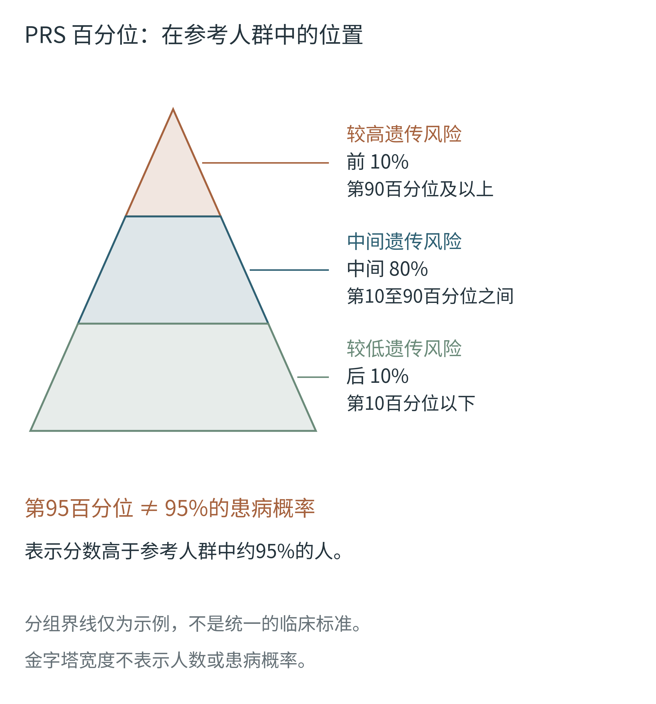

# 第八章新版 F22

## 图 F22｜PRS 百分位表示相对位置



[PNG（600 dpi）](outputs/png/F22_prs_percentile_pyramid.png) · [PDF（矢量）](outputs/pdf/F22_prs_percentile_pyramid.pdf) · [SVG（可编辑文字）](outputs/svg/F22_prs_percentile_pyramid.svg) · [Python 源码](F22_prs_percentile_pyramid.py) · [检查记录](outputs/manifests/F22_validation.json)

本图替换新版第八章已经删除的旧 F22“同样风险翻倍，不同绝对风险”。放在“遗传信息能补上什么”中，多基因风险评分与百分位示例之后。F23 保留原图。

### 读图要点

- 百分位描述 PRS 在适用参考人群中的相对位置，不等于患病概率。
- 第95百分位表示分数高于参考人群中约95%的人，属于分数最高的约5%。
- 前10%、中间80%、后10%仅为示例分组。具体界线取决于疾病、评分模型和用途；不是统一临床标准。
- 金字塔只表示从较低到较高的分层顺序。宽度和面积不表示人数、评分分布或患病概率。
- 实际风险估计还需结合年龄等信息；本图不是临床风险计算器。

### 重建与微调

在仓库环境中安装 `matplotlib`、`fonttools`，运行：

```bash
python chapter8_revision/F22_prs_percentile_pyramid.py
```

脚本复用根目录 `book_style.py`、`palette.py` 和 `fonts/NotoSansSC-Regular.ttf`，沿用“海青与铜”配色。修改 `LAYOUT` 可调整几何和字号，修改 `LABELS` 可调整分层文字。输出尺寸108 × 116 mm，最小字号8.5 pt；Word中按106 mm宽插入。

输出包括600 dpi PNG、嵌入字体的矢量PDF、保留文字并嵌入子集字体的SVG。脚本检查文字越界、文字互相重叠及缺字，并生成文件哈希；成图及插入后的Word均另做目视检查。原始全书套装及其审计记录保留为历史版本，原 `build_all.py` 不会重建本修订图。

### 依据

- [PRS 报告标准（Nature, 2021）](https://www.nature.com/articles/s41586-021-03243-6)：参考人群、模型及风险呈现需要明确。
- [临床多基因风险检测研究（Nature Medicine, 2022）](https://www.nature.com/articles/s41591-022-01767-6)：分层界线与具体疾病、检测设计相关。
- [Mayo Clinic eMERGE：Polygenic risk scores](https://www.mayo.edu/research/emerge-genome-informed-risk-assessment/risk-assessment/polygenic-risk-scores)：相对参考人群的风险、遗传背景和非遗传因素的解释。

以上为概念与呈现依据；图中10%/80%/10%和第95百分位为教学示例，未引用真实患者数据。
